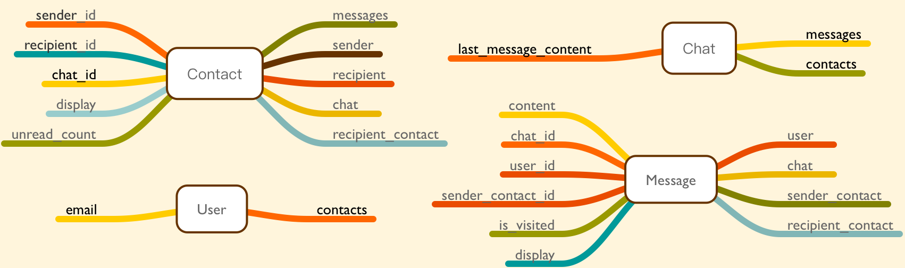

# MiniCat

这里实现的是一个简单的一对一聊天App。

```
bundle
rake db:create
rake db:migrate
rake db:seed
rails server
```

## 需求

包含以下功能：

- 用户可以注册、登录。需要 id（可以自己决定 email 或者 username）和 password (完成)
- 用户登录后，进入联系人列表页面 (完成)
- 可以看到自己所有的联系人 (完成)
- 每个联系人需要显示对方 id 以及未读私信数量提醒 (完成)
- 用户可以通过 id 添加新联系人（可以不需要对方同意）(完成)
- 用户可以删除某个联系人，但保留与对方用户的消息等数据。当再次添加新联系人时，消息等数据都还在 (完成)
- 点击一个联系人会进入聊天界面，同时未读消息置为 0 (完成)
- 可以看到和某个用户的历史消息 (完成)
- 能够在这里收发私信（不需要实时，可以刷一下页面才看到新消息） (完成)
- 当用户 A 发私信给用户 B 时，如果 A 还不是 B 的联系人，应该自动把 A 添加为 B 的联系人，并能够在 B 的联系人列表正常显示（不需要实时）(完成)
- 用户可以删除自己发的消息 (完成)
- 联系人列表页面未读消息数实时更新
- 聊天界面新消息实时接收
- 自动把 A 添加为 B 联系人时，B 实时更新联系人列表
- 部署，可在线演示


## 思路
首先需要思考的是数据模型。
这里的问题是在于Chat，Contact，Message的关系思考。

### 方案一
- Chat 类似于邮件，每个 chat 都能拿到在自己 chat 中的所有 messages。
- Contact 是一个收发联系表，两个用户的交流，会产生两个 contact。对于其中一个用户来说，一个是发件箱，一个是收件箱。
- 每个 message 绑定产生它的 chat、发件箱、发件人。
- 每个 message 都是从发件箱发出，通过查询找到唯一匹配的收件箱，并更改收件箱中 unread_count 属性。
- 如果收件箱未创建，或者是未显示。都会在 message 发送时，创建或者显示。

### 方案二
- Chat 类似于聊天室，每个 chat 都能拿到在自己 chat 中的所有 messages。
- chat 与 user 成多对多关系。
- 每个 message 绑定产生它的 chat、user 关联。
- 没有 Contact 表。
- 联系人列表显示的是该user的 chat 列表。

## 实现

- 考虑到一对一的功能，选择了方案一。
- 用户不能添加自己为联系人。
- 对方从未建立过自己的联系会被标记为陌生人。

## 可以进一步的地方
- 方案一中的，contact 承担了发件箱和收件箱的两种功能。容易混淆。
- 没有成功和错误提示。
